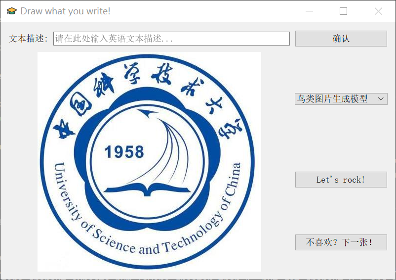

# Text-image-generation
This is my graduation project. This is a Pytorch 1.4.0 implementation for reproducing AttnGAN results in the paper [AttnGAN: Fine-Grained Text to Image Generation with Attentional Generative Adversarial Networks](http://openaccess.thecvf.com/content_cvpr_2018/papers/Xu_AttnGAN_Fine-Grained_Text_CVPR_2018_paper.pdf).

## Model Training


## GUI Interface
Simply follow the following command:

```python
cd GUI_Interface
python app.py
```




