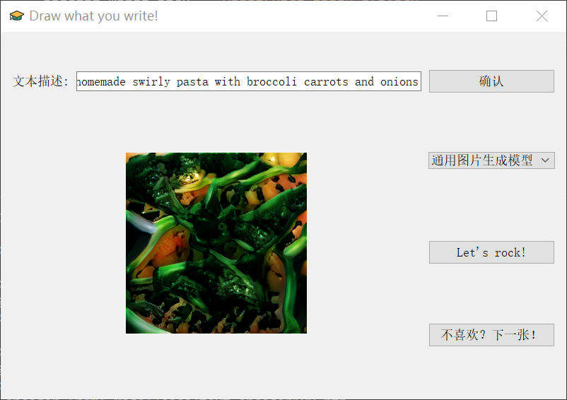

# Text-image-generation
This is my graduation project. This is a Pytorch 1.4.0 implementation for reproducing AttnGAN results in the paper [AttnGAN: Fine-Grained Text to Image Generation with Attentional Generative Adversarial Networks](http://openaccess.thecvf.com/content_cvpr_2018/papers/Xu_AttnGAN_Fine-Grained_Text_CVPR_2018_paper.pdf).


## Dependencies

- Pytorch 1.4.0
- Torchvision 0.4.1
- python 3.6
- other packages may be need


## Model Training
1. Download the necessary datasets and save them to data/birds and data/coco
2. Download the metadata for birds/coco and save them to data/

```python
cd Model_Training
# pretrain DAMSM model:
python pretrain_DAMSM.py --cfg cfg/DAMSM/bird.yml --gpu 0
python pretrain_DAMSM.py --cfg cfg/DAMSM/coco.yml --gpu 1

# train text-image model:
python main.py --cfg cfg/bird_attn2.yml --gpu 0
python main.py --cfg cfg/coco_attn2.yml --gpu 1

# sample for all validation or customed text:
python sample.py

```

## GUI Interface
After obtain the necessary trained model for bird/coco and savce them to Model/, simply follow the following command:

```python
cd GUI_Interface
python app.py
```




## Reference
[AttnGAN: Fine-Grained Text to Image Generation with Attentional Generative Adversarial Networks](http://openaccess.thecvf.com/content_cvpr_2018/papers/Xu_AttnGAN_Fine-Grained_Text_CVPR_2018_paper.pdf).

